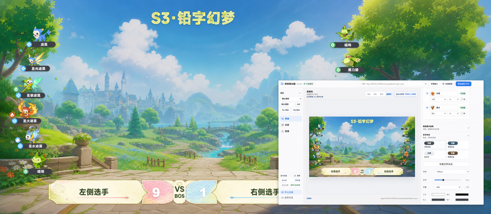

# 洛克王国世界阵容叠加器

面向 Windows 与 OBS 直播场景的双队阵容叠加工具。填写双方精灵后，可直接获得透明阵容、完整直播间画面、比赛信息栏和 PNG 备份。



[](https://github.com/zhangzeyu99-web/rock-roster-overlay/actions/workflows/ci.yml)
[](https://github.com/zhangzeyu99-web/rock-roster-overlay/releases/latest)


## 下载

当前稳定版：**v3.5.0**

[下载 Windows 安装包](https://github.com/zhangzeyu99-web/rock-roster-overlay/releases/latest)

安装包不进入 Git 历史，每个正式版本统一放在 GitHub Releases，并在发布说明中记录 SHA256。

## 核心能力

- **双队阵容**：左右各 6 只精灵，支持搜索、快速导入、形态切换和战败状态。
- **两套排布**：默认弧形阵容与兼容旧配置的垂直阵容，可按项目切换。
- **直播间装修**：背景、标题、选手名、比分、赛制和自由文本均可编辑。
- **S3 计分栏**：三套赛季样式，支持栏宽、选手名和比分字号调整。
- **OBS 实时采集**：提供左队、右队、双方和完整直播间四类浏览器来源。
- **临场控制**：独立置顶快捷窗口可修改阵容、形态、战败状态和比分。
- **备份输出**：支持整图、单队和直播间 PNG 导出。

## 使用流程

1. 在“阵容”页填写或导入左右队精灵。
2. 在“装修”页选择排布、计分栏和直播间样式。
3. 在“直播”页复制对应 OBS 地址，或先导出 PNG 检查画面。
4. 直播中使用“快捷控制”更新比分、战败状态和精灵形态。

完整步骤见 [直播工作流](docs/live-workflow.md)。

## OBS 来源

| 来源 | 推荐尺寸 | 用途 |
| --- | --- | --- |
| 左队 | `420 x 1080` | 只采集左侧 6 只阵容 |
| 右队 | `420 x 1080` | 只采集右侧 6 只阵容 |
| 双方 | `1920 x 1080` | 透明采集左右两队阵容 |
| 直播间 | `1920 x 1080` | 背景、标题、阵容和计分栏完整合成 |

编辑器保存后，OBS 浏览器来源会自动刷新。720p、1080p、1440p 使用同一套响应式布局逻辑。

## 本地开发

```powershell
npm ci
npm run dev
```

常用检查：

```powershell
npm run lint
npm test
npm run assets:quality
npm run build
npm run e2e
```

生成 Windows 安装包：

```powershell
npm run dist
npm run verify:package
```

构建产物位于 `release/`，本地运行数据默认位于 `%USERPROFILE%\Documents\RockRosterOverlay`。

## 项目结构

| 目录 | 内容 |
| --- | --- |
| `electron/` | Electron 主进程、本地服务与数据存储 |
| `src/core/` | 阵容、预设、匹配、捕获和业务逻辑 |
| `src/renderer/` | React 编辑器、直播画布和快捷控制 |
| `public/` | 直播间背景、标题、计分栏和属性图标 |
| `seed-data/` | 内置精灵、头像与图鉴数据 |
| `tests/`、`e2e/` | 单元测试与 Playwright 端到端测试 |
| `scripts/` | 构建、素材同步和发布验证脚本 |

## 版本维护

项目按语义化版本维护。变更记录见 [CHANGELOG.md](CHANGELOG.md)，发布步骤见 [版本维护说明](docs/version-maintenance.md)。

- `major`：配置或使用流程存在不兼容变更。
- `minor`：新增可见功能、素材体系或主要样式。
- `patch`：缺陷修复、布局打磨和兼容性调整。

## 参与维护

- 缺陷请提交 [Bug 报告](https://github.com/zhangzeyu99-web/rock-roster-overlay/issues/new?template=bug_report.yml)。
- 功能建议请提交 [功能建议](https://github.com/zhangzeyu99-web/rock-roster-overlay/issues/new?template=feature_request.yml)。
- 提交代码前请阅读 [CONTRIBUTING.md](CONTRIBUTING.md)。

## 素材与许可

本项目为非官方直播辅助工具。游戏名称、角色形象及相关美术素材的权利归原权利人所有，仓库素材仅用于实现阵容展示功能。

仓库当前未附加开源许可证。公开可见不等于获得复制、分发或商用授权。
